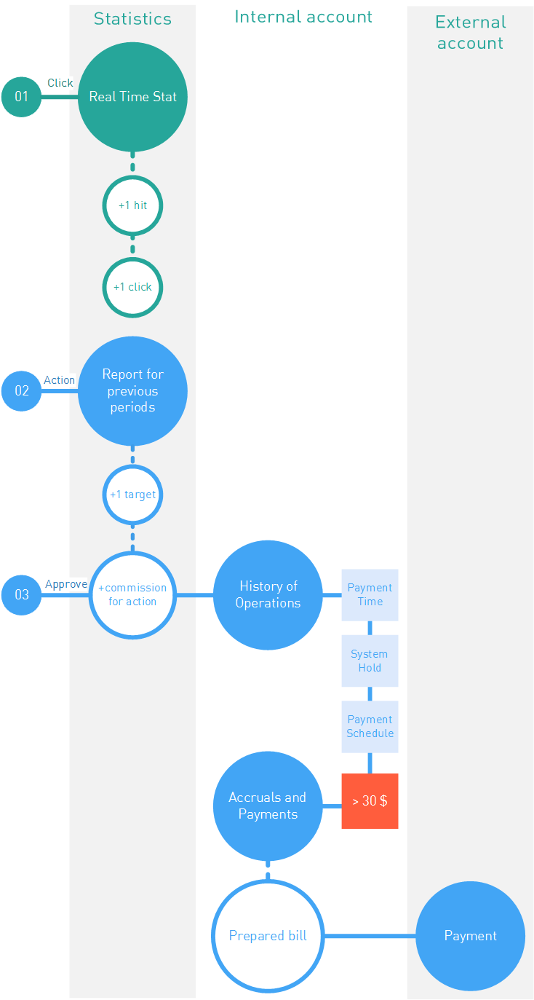

.. _commission-interface-label:

====================
Fee in the interface
====================

The main goal of the publisher cooperating with an affiliate network is to get a fee for his/her job. That's why our interface is strongly customized for control and tracing of the fee. Before the traffic redirected to the affiliate links is converted in real profit, it will be transformed many times. Thus, fee tracing in an affiliate network is not an easy task, but we tried to make everything as simple as possible.

Below you can find a figure that can serve as a reminder: where you can find a fee before it's converted into real money in your wallet.

..
   .. csv-table::
      :header: "Символ", "Описание", "Значение"
      :widths: 10, 10, 10
      
      |circle|, "Сплошной кружок", "Интерфейс в нашей системе, где нужно искать"
      |bublic|, "Бублик с надписью", "Объект, который нужно искать"

So, to trace the development of your fee in the interface :ref:`from click to payment <from-click-to-payout-label>`, you need the following:

#. Start from searching the :ref:`Statistics <statistics-label>`, here you can see all clicks on your links. Each click is the potential earning, so additional control will be quite useful. To get the latest information use the :ref:`Real Time Report <stat-realtime-label>`. 

#.	When a conversion occurs at the side of the advertiser, our system displays it as open leads or targets. In the :ref:`Statistics <statistics-label>` you can trace the development of :ref:`clicks→leads→actions <click-lifecycle-label>`, but before the advertiser confirms the target there's no fee as such.

    In the **Statistics** (e.g. in reports on **Offers**) 1 will be added to the targets counter.
   
#. After the advertiser reports to our system that the target is reached, the system will accrue a fee for the publisher (the fee amount can be found on the tab: :menuselection:`Offers | Offer Card | Payments`). Then the sequence is as follows:

   #. In :ref:`Statistics <statistics-label>` (e.g. in reports on **Offers**) the approved fee will be added to the total fee of the publisher.
   
      .. attention::  If the advertiser :ref:`uploads <conversion-download-label>` data only once per month, then accrual on the :ref:`internal account <internal-acc-label>` of the publisher will also happen monthly.
      
   #. In parallel to the :ref:`Statistics <statistics-label>` the following section will be updated too: :menuselection:`Office | Finance and payments | Operations history`. All accruals on the :ref:`internal account <internal-acc-label>` вof the publisher from the moment of registrations are accumulated here. All operations are grouped per days, so the fee will be displayed for the day of the registration in our system.

   #. Basically, the money is now earned, but the payment to the :ref:`external account <external-acc-label>` of the publisher will require certain time. During this period money will be transferred from the advertiser to our system (**Payment time**). Then the traffic inspection for cleanliness will happen (**System Hold**). If the inspection is successful, then on the next scheduled date of payment the fees will be paid from the system to the :ref:`main external account <external-acc-label>` of the publisher.
   
      .. attention:: Please note that for the payment to be executed to the total amount of the fees shall exceed the :ref:`minimum amount <min-payout-label>`.
      
   #. According to the payments schedule in section :menuselection:`Office | Finance and payments | Accruals and payments` the new :ref:`payment <payout-label>` will be performed. 

   #. When in :menuselection:`Office | Finance and payments | Accruals and payments` :ref:`the payment <payout-label>` пstatus will be  :ref:`paid <payout-label>`, you can check the balance of your :ref:`main external account <external-acc-label>`.
