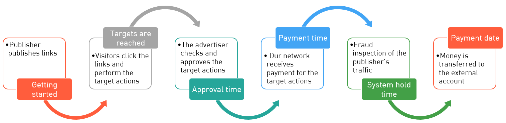
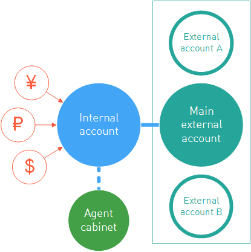

=====================
Finantial Information
=====================

:menuselection:`Home | Finances and payments| Accruals and Payments` payments section contains all the information related to financial aspects of cooperation with the publisher. Here you can check the balance of the :ref:`internal account <internal-acc-label>` иand track the daily accruals on :menuselection:`Finances and payments | History of Operations`. :menuselection:`Finances and payments | Exchange Rates` tab is for information only, it contains the rate of exchange used for the settlements in the system. Here you can also find the :ref:`agency accounts <agent-cabinet-label>`, that can be used for working with external ad systems.

.. _from-click-to-payout-label:

************************
Click-to-payment path
************************

So, if you started providing traffic to the offer, it does not mean anything so far. Particularly it does not mean that tomorrow you're going to receive payments for leads. That's because the process of tracing the :ref:`clicks→leads→actions <click_lifecycle_label>` is rather complex. To guarantee high quality in our system we use the following scheme for working with payments:

#. First, the publisher publishes links on his/her sources. So far there's nothing in the :ref:`Statistics <statistics-label>`. Visitors haven't noticed the ads and thus haven't clicked on them so far.

   .. seealso:: How to trace the :ref:`commission in the interface <commission-interface-label>`. 

#. :ref:`Statistics <statistics-label>` is live now, so visitors view the adverts and perform some actions. So, on this stage the publisher has got the traffic related to the offer. But so far there are no *approved* lead or target, only *open* leads and targets. That's because technically we can present the information on leads or targets in the real time, but these figures have not been verified so far. I.e. those *open* leads have not been approved by the advertiser.
   
   .. attention:: Some advertisers submit this data with delays. See detailed information on :ref:`conversions upload <conversion-download-label>`.
      
#. **Approval time**. The advertiser checks the leads an targets, the achievements and their quality. Poor-quality leads are rather widespread: incomplete applications, or applications with jumbled text. Some actions can also be rejected by the advertiser: e.g. the customer canceled the delivery and did not buy the ordered goods.

   .. attention:: Not all open leads will become approved leads. Open leads form the amount of the potential earning, not the guaranteed earning.

#. **Payment  time**. The advertiser provides the information on *approved* and *rejected* targets. After the inspection by the advertiser *open* leads will become *approved* (or *rejected*, if the lead was not approved for some reason). Only after the above process is completed, we start the settlements with the advertiser. Now the advertiser pays money for all the approved targets, and the earned money will be transferred to the internal account of the publisher.
#. **System hold time**. After receiving data from the advertiser we start the active processing of it. We check the traffic for fraud, and this is the task that we are rigorous about.

   .. seealso:: See more details on :ref:`payments <payout-label>` and :ref:`external accounts <external-acc-label>`.

#. And then the scheduled payment date comes. After all the waiting and suffering the publisher receives the:ref:`payment <payout-label>`. ЭPayments are made according to the schedule, and the funds are transferred to the  :ref:`main external account <external-acc-label>` specified by the publisher.

.. _internal-acc-label:

****************
Internal account
****************

.. attention:: Remember that changing the currency of the internal account is a charged operation. The commission is 3%.

After registration in the system each publisher will receive the internal account containing all the information on the cash flow of the publisher in the system. Earned money are deposited to the internal account and then paid to the external accounts.

An internal account has three major properties affecting the publisher's payments. The relevant information can be found in :menuselection:`Home | Finance and payments | Accruals and payments`:

.. image:: ../../img/account/fin_balance.png
       :align: right
       :alt: major properties of internal accoun

#. Currency used by the system for accruals of funds to the internal account. Currency used for accruing the publisher's earnings is the main property of the internal account. You can choose any of the following currencies:

   * RUB — Russian ruble
   * USD — US dollar
   * EUR — euro, official currency of the eurozone.
   * UAH — Ukrainian hryvnia
   * KZT — Kazakhstan tenge
   * CNY — Chinese yuan
   * BRL — Brazil real
   * MXN — Mexican peso
   * MYR — Malaysian ringgit
   * PLN — Polish zloty

#. _`Payment schedule`. Transfer of money to the external account basically means payment of the publisher's earning to the personal account of the publisher. It happens twice per month, :guilabel:`on the 1st and 16th` day of the month, no lunch time or days off. We call it the *payment schedule*. By agreeing to work with us, the publisher agrees to that schedule too.
#. Hold time is the individual setting reflecting the time of delay with transferring the money. The system checks the traffic.

.. _payout-label:

********
Payments
********

Payments to publishers' external accounts are made in according to the payment schedule. To be eligible to withdraw their earnings from the system, a publisher must:

.. tip:: If the hold time is beyond reasonable (i.e. 14,999 days), the payment is probably under revision and is frozen for the duration. Don't panic: if your traffic is clean, you can easily resolve the issue with tech support |support|_.

#. Have an External account to transfer the money to.
#. Earn more than the minimum withdrawal amount.
#. Not be banned. This means providing clean honest traffic that our QA experts won't find suspicious.

.. _min-payout-label:

Minimum withdrawal
==================

By agreeing to work with us, publisher accepts, among other things, the condition of minimum withdrawal. Minimum withdrawal amount is the minimum amount we will transfer to external accounts.

.. csv-table::
   :widths: 5, 5
   
   "Bank transfer", "Any currency: the equivalent of $300"
   "Bank transfer if the publisher is registered in Brazil", "Any currency: the equivalent of 300 BRL"
   "Bank transfer if the publisher is registered in Mexico", "Any currency: the equivalent of 1000 MXN"
   "Other types of transfers", "Any currency: the equivalent of $30"

If there is not enough money on the internal account to transfer, the funds will remain on the internal account.

Note that external systems may have limitations for transfer amounts as well. Please familiarize yourself with them:

* `Yandex.Money <https://money.yandex.ru/doc.xml?id=523014&ncrnd=4224>`_
* `WebMoney <https://wiki.wmtransfer.com/projects/webmoney/wiki/WebMoney_Keeper_Standard_financial_restrictions>`_
* PayPal

.. _payment-status-label:

Payment statuses
================

All payments made through our system go through several stages before reaching your external account. These stages are called Statuses, and each payment in :menuselection:`Office | Finance and payments | Accruals and payments | All account transactions` table has one.

.. seealso::Statuses for PayPal and bank transfers and their descriptions are :ref:`below <bank-payout-label>`.

.. rubric:: Payments to WebMoney and Yandex.Money

These payments go through three positive statuses:

#.	**New**. This represents that we have just recently created the withdrawal application and prepared the funds.
#.	**On Payment**. This means that the transfer process for this application is under way, but the recipient system did not confirm the transfer just yet.
#.	**Paid**. This status shows that the process is complete, the money is on your external account, and everything went according to plan.

.. image:: ../../img/account/finance/payout_status.png
   :scale: 100 %
   :align: center
   :alt: payment statuses
   
Sadly, there are times when the recipient system will decline the transfer, due to various reasons. Should this be the case, the relevant operation in :menuselection:`Office | Finance and payments | Accruals and payments | All account transactions` table will be marked as **Cancelled**, and the funds will be returned to your internal account. Don't panic and contact tech support |support|_. Our experts will help you figure out the problem and quickly solve it.
   
.. _bank-payout-label:

.. rubric:: PayPal and bank transfers

.. attention:: `Invoice <https://en.wikipedia.org/wiki/Invoice>`_ must be provided for each regular payment. 

PayPal or bank transfers are more complicated, as they require the publisher to provide invoices for the payment to come through.

Now let's see what happens with a PayPal or bank transfer application in :menuselection:`Office | Finance and payments | Accruals and payments | All account transactions`:

#. First status is **New**: the transfer application is created within the system.
   
   .. attention:: If the documents were not uploaded within 10 days, the status will automatically change to **Declined**.
    
#. Next, the application status will change to **Document required**. A new button will be enabled in the **All account transactions** table: |bracket| . It is used to upload documents. This status requires actions from the publisher and expires in 10 days.
#. As soon as the invoices are provided, the status will change to **Document check**. This means that the documents are being reviewed by our managers.

   .. tip:: After all required documents are provided, the funds will be transfered to your external account within 3 business days.

#. The application status may change back to **Document required** if the documents provided are insufficient. You can find out what was missing or incorrect in your documents by checking the comment to the status.
#. After the documents are verified, application status will change to **On Payment**, and later to **Paid**. This status shows that the process is complete, the money is on your external account, and everything went according to plan.

.. image:: ../../img/account/finance/payout_status_bank.png
   :scale: 100 %
   :align: center
   :alt: bank payment statuses

Sadly, there are times when the recipient system will decline the transfer, due to various reasons. Should this be the case, the relevant operation in :menuselection:`Office | Finance and payments | Accruals and payments | All account transactions` table will be marked as **Cancelled**, and the funds will be returned to your internal account. Don't panic and contact tech support |support|_. Our experts will help you figure out the problem and quickly solve it.

.. |bracket| image:: ../../img/account/finance/bracket.png
