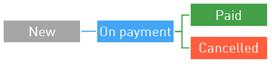
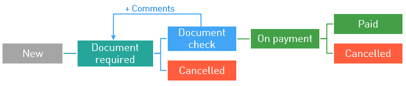

=====================
Finantial Information
=====================

.. _payout-label:

********
Payments
********

Payments to publishers' external accounts are made in according to the payment schedule. To be eligible to withdraw their earnings from the system, a publisher must:

.. tip:: If the hold time is beyond reasonable (i.e. 14,999 days), the payment is probably under revision and is frozen for the duration. Don't panic: if your traffic is clean, you can easily resolve the issue with tech support.

#. Have an External account to transfer the money to.
#. Earn more than the minimum withdrawal amount.
#. Not be banned. This means providing clean honest traffic that our QA experts won't find suspicious.

.. _min-payout-label:

Minimum withdrawal
==================

By agreeing to work with us, publisher accepts, among other things, the condition of minimum withdrawal. Minimum withdrawal amount is the minimum amount we will transfer to external accounts.

.. csv-table::
   :widths: 5, 5
   
   "Bank transfer", "Any currency: the equivalent of $300"
   "Bank transfer if the publisher is registered in Brazil", "Any currency: the equivalent of 300 BRL"
   "Bank transfer if the publisher is registered in Mexico", "Any currency: the equivalent of 1000 MXN"
   "Other types of transfers", "Any currency: the equivalent of $30"

If there is not enough money on the internal account to transfer, the funds will remain on the internal account.

Note that external systems may have limitations for transfer amounts as well. Please familiarize yourself with them:

* `Yandex.Money <https://money.yandex.ru/doc.xml?id=523014&ncrnd=4224>`_
* `WebMoney <https://wiki.wmtransfer.com/projects/webmoney/wiki/WebMoney_Keeper_Standard_financial_restrictions>`_
* PayPal

.. _payment-status-label:

Payment statuses
================

All payments made through our system go through several stages before reaching your external account. These stages are called Statuses, and each payment in Office | Finance and payments | Accruals and payments | All account transactions table has one.

.. seealso::Statuses for PayPal and bank transfers and their descriptions are :ref:`below <bank-payout-label>`.

.. rubric::Payments to Webmoney and Yandex.Money

These payments go through three positive statuses:

#.	**New**. This represents that we have just recently created the withdrawal application and prepared the funds.
#.	**On Payment**. This means that the transfer process for this application is under way, but the recipient system did not confirm the transfer just yet.
#.	**Paid**. This status shows that the process is complete, the money is on your external account, and everything went according to plan.

   
Sadly, there are times when the recipient system will decline the transfer, due to various reasons. Should this be the case, the relevant operation in :menuselection:`Office | Finance and payments | Accruals and payments | All account transactions` table will be marked as **Cancelled**, and the funds will be returned to your internal account. Don't panic and contact tech support |support|_. Our experts will help you figure out the problem and quickly solve it.
   
.. _bank-payout-label:

.. rubric:: PayPal and bank transfers

.. attention:: `Invoice <https://en.wikipedia.org/wiki/Invoice>`_ must be provided for each regular payment. 

PayPal or bank transfers are more complicated, as they require the publisher to provide invoices for the payment to come through.

Now let's see what happens with a PayPal or bank transfer application in :menuselection:`Office | Finance and payments | Accruals and payments | All account transactions`:

#. First status is **New**: the transfer application is created within the system.
#. Next, the application status will change to **Document required**. A new button will be enabled in the **All account transactions** table: |bracket| . It is used to upload documents. This status requires actions from the publisher and expires in 10 days.
#. As soon as the invoices are provided, the status will change to **Document check**. This means that the documents are being reviewed by our managers.
#. The application status may change back to **Document required** if the documents provided are insufficient. You can find out what was missing or incorrect in your documents by checking the comment to the status.
#. After the documents are verified, application status will change to **On Payment**, and later to **Paid**. This status shows that the process is complete, the money is on your external account, and everything went according to plan.

Sadly, there are times when the recipient system will decline the transfer, due to various reasons. Should this be the case, the relevant operation in :menuselection:`Office | Finance and payments | Accruals and payments | All account transactions` table will be marked as **Cancelled**, and the funds will be returned to your internal account. Don't panic and contact tech support |support|_. Our experts will help you figure out the problem and quickly solve it.

