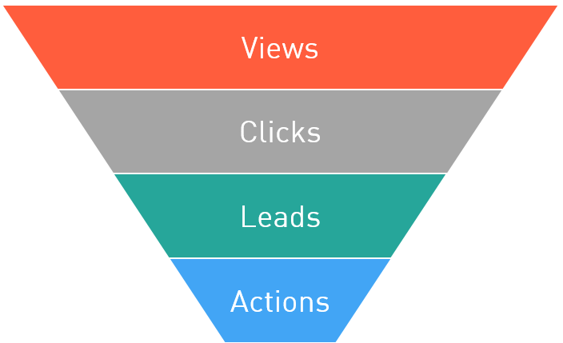
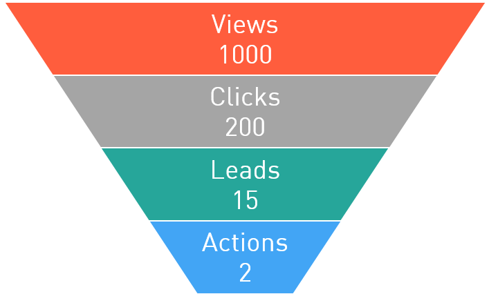

==========
Conversion
==========

In the Internet marketing conversion is all about the efficiency of advertising. And this efficiency is measured on each stage towards the ultimate goal. Here we are getting to the key point in understanding the affiliate networks and the Internet marketing in general. Below we will review the transition from the simple viewing of the ad to the target action.

So, where does the advertising start? It starts from an ad. And good advertising needs good ads. How can you understand whether an ad is good? And which of any two ads is better? Of course, you can post your dummy ad to `Red dot <http://en.red-dot.org/>`_, wait for feedback, re-work it and publish The Best Design according to `their<http://www.red-dot.sg/en/jury/>`_ version. But obviously in this case we'll get the most beautiful ad, not the most efficient one…

Now, *what is the efficient advertising*? If you consult with the Wikipedia, you'll get the feeling that calculation of efficiency will require involvement of a think tank or even two. And you will be not far from the truth :). But for making reasonably fast and informed decisions you need fast techniques that will be clear both for the advertiser and publisher who promotes an offer. Such methodology is the assessment of *conversion*.

Before introducing the concept of conversion, let's outline the life cycle of a **Click** on its way to the target action.

.. _click-lifecycle-label:

****************
Click Life Cycle
****************

Before clicking an add the visitor needs to first see it, look at it. **Viewing** is the first acquaintance. The next step is the **Click** on the banner or link to redirect the visitor to an external landing page.

LANDING PAGE
   The page to which the visitor gets after clicking on the advertisement link.

Despite the fact that there may be complex schemes for various redirects of visitors between websites, in the end the visitor gets on the advertiser's website. Here the visitor may fill in a registration form, play a game, or add goods to the cart, i.e. perform some targeted actions. Part of them are primary actions with the earning potential (e.g. if a person leaves his/her contacts then he or she becomes a lead). Such actions are called **Leads**.

LEAD IN CPA MODEL
   This is a primary action on the advertiser's website. Such action is the primary target, and then there will be others =)

Once the user has performed some preparatory steps (primary actions), **Target actions** that are payable by the advertiser according to the terms of the offer come into.

TARGET ACTIONS IN CPA MODEL
   This is the action of the visitor being the *target* of the advertiser, the action for which he pays.

The basic chain of the visitor's actions is as follows:

.. _conversion-label:

************************************
Conversion in the Digital marketing
************************************

For example, let's take two adjacent actions, such as **View** and **Click**. Our ad is in-between. I.e. the ad is the bridge for the user from the view to the click. If we know how many users the ad has brought to the click, we can assess its efficiency.

CONVERSION
   Visitor proceeding from one action in the chain to the next action.

If we nit-pick, it's the accomplished fact of the clickthrough. But we won't nit-pick. Let's better look at the example demonstrating why we need to assess the conversions and their benefits.

So, we have an ad. Or better two. We've got two ads and we want to decide which one is better. Let's publish them on two imaginary websites and show the first ad to 1K of imaginary users, and the second ad to 2K of imaginary users. We can easily calculate the number of users who clicked the ad. We'll get quite common figures:

.. csv-table::
   :header: "", "How many users viewed the ad", "How many users clicked the ad (number of conversions)"
   :widths: 5, 10, 10

   "Ad 1", 1000, 200
   "Ad 2", 2000, 200

If we calculate the share of users who clicked the ad, we'll get the following ratio: *Conversions / Previous actions*. In other words, we will know how many actions turn into conversions. In other words, we will know the **Conversion rate**.

CR, CONVERSION RATE
   It's the ratio between the performed actions (conversions) and the total number of visitors.

We can calculate the views-to-clicks conversion rate. It is referred to as CTR (Click-through rate). As you guessed, it's the ratio between clicks on the ad and views of this ad.

Complex algebraic computing gives the following results:

.. csv-table::
   :header: "", "How many users viewed the ad", "How many users clicked the ad (number of conversions)", "CTR"
   :widths: 5, 10, 10, 3

   "Ad 1", 1000, 200, "20%"
   "Ad 2", 2000, 200, "10%"

These figures are very important, since they allow us to assess the ad efficiency. If we look at CTR of each ad we'll see that despite the same number of clicks (200) the first ad was clicked twice as much as the second ad: 20% VS 10%. We can assume that it is more effective (other things being equal, of course), because the conversion rate of the first ad is higher.

*****************
Conversion funnel
*****************

Thus, for every action of the click life cycle we can assess the "convertibility", knowing the number of visitors *before* and *after* the conversion. Since the number of visitors who perform actions always decreases from stage to stage in the chain, the traditional visualization is as follows:

This diagram is called the **Conversion funnel**. And there is an indicator for each action that tells you how many people were "converted" to the next step:

.. csv-table::
   :header: "", "Term", "Comments"
   :widths: 4, 4, 10

   "View → Click", "CTR (Click-through rate)","Ratio between clicks and views. You can assess the attractiveness of advertising indirectly, judging from its exterior."
   "Click → Lead", "CR (Conversion Rate)","Often referred to as the conversion, because this figure is very informative — it means the number of users who clicked on ads and became the leads. I.e. they became customers who are in fact ready to use our product (or service). The conversion rate allows indirect assessment of the advertisement efficiency. And since it is calculated based on the huge amount of raw data, it can be used to predict the effectiveness of different ads."
   "Lead → Target action", "AR (Approval Rate)","This figure shall be reviewed in the context of CPA schemes. In such schemes there's always the advertiser acting as the source of feedback. The advertiser tells us whether the target action was performed or not. Only the advertiser can do it, because these targeted actions are tracked in the advertiser's system. To generalize, the advertiser approves the actions. And AR figure tells us how many **Leads became** the **Target actions**."

.. _macroconvercion_label:

****************************
Micro- and macro conversions
****************************

So, we calculated the conversion metrics at different stages of the customer "processing". Still we have plenty of data for more detailed analysis. Again, we imagine that we have an ad that we showed to 1000 imaginary customers, lets trace the number of clicks to the bitter end, to the **Target action**:

For each stage we'll calculate the conversion rates:

.. csv-table::
   :header: "Views", "CTR", "Clicks", "CR", "Leads", "AR", "Target action"
   :widths: 10, 10, 7, 7, 8, 8, 15

   1000, "20%", 200, "7.5%", 15, "13.3%", 2

ВThese conversions between the two closest "states" of the user are called **Micro conversions**. Let's skip a couple of stages and calculate the conversion, cause I can as they say. We'll see that the conversion of **Clicks** into **Target actions** is

	2 ÷ 200 = 1%.

Such conversion is called **Macroconversion**. It is used for approximate calculations: e.g. we can estimate the revenue from 1000 clicks on our ad.

.. tip:: The revenue or fee from one click is called CPC (Cost Per Click).

Let's assume that the advertiser pays $5 per **Target action**. Then, knowing the macroconversion we can estimate (forecast) the revenue from one click

	5 × 1% = 0,05.

And then we can estimate (forecast) the revenue from 1000 clicks too:

	$0,05 × 1000 = $50

***********************
Average cost of click
***********************

So, if we provide the traffic for the offer diligently and calculate the conversions we'll have the highly valuable figures — the cost of one click (we made a forecast of this figure :ref:`above <macroconvercion_label>` мыbased on the conversion) and the cost of 1000 impressions.

CPC (COST PER CLICK)
   In CPA model it means the revenue from the click that you earn by providing the traffic for a specific offer.
	
CPM (COST PER MILLE)
   In CPA model it means the revenue from 1000 impressions that you earn by providing the traffic for a specific offer.

Real CPC and CPM
================

Suppose the advertiser offers 250 rubles per one pair of sold shoes (don't forget, this is the target for CPS model). We provide traffic for this offer and after a week 10 pairs of shoes will be sold. So we get 2500 rubles. Let's look at the offer statistics to see the number of clicks on the link to the shoes. Suppose there were 13000 views and 1500 clicks.

Then, to calculate the CPC (cost per click) we divide the total revenue by the number of clicks:

	2500 ÷ 1500 = 1.67 (rubles) — CPC in our case.
	
To calculate CPM — cost per mille — we divide the profit by the total number of impressions and multiply by 1000:

	(2500 ÷ 13000) × 1000 = 192.3 (rubles)

Effective CPC (eCPC)
====================

Now imagine the volume of such statistics in the affiliate network where dozens of publishers provide traffic to a single offer. The partner network can divide ALL earnings for the offer, received by publishers of this network, by ALL clicks on the links under the offer. As a result we get the following:

**eCPC (Effective Cost per Click) = sum of the fees for all publishers under the offer ÷ number of clicks on the links under the offer**.

This figure, in fact, strongly depends on the statistics collection period. For example, if the offer is new, then few publishers work with it, the statistics is scarce, and it is not very representative. After all, each publisher uses his/her own approach: some use arbitrage, some work with forums, others work with news websites. Conversions will differ greatly in these cases. However, after some time the statistics will become representative and almost non-sensitive to external factors. Taking this into account, we differentiate between two effective CPC: for a week (7D eCPC) and for the last three months (3M eCPC).

.. rubric:: 7D eCPC

7D eCPC is easier to collect, because you don't need to wait for 3 months. It may reflect fluctuations in supply and demand, such as New Year's boom when the figure soars to the heavens.

.. rubric:: 3M eCPC

3M eCPC gives a more sober estimate because it covers a long period and does not depend on holiday deviations. But on the other hand it does not take into account obvious mistakes and miscalculations, poor quality traffic, etc… well, it's a very generalized and average figure.

The affiliate network willingly shares the eCPC figure since it allows publishers to estimate the benefits of working with the offer.
