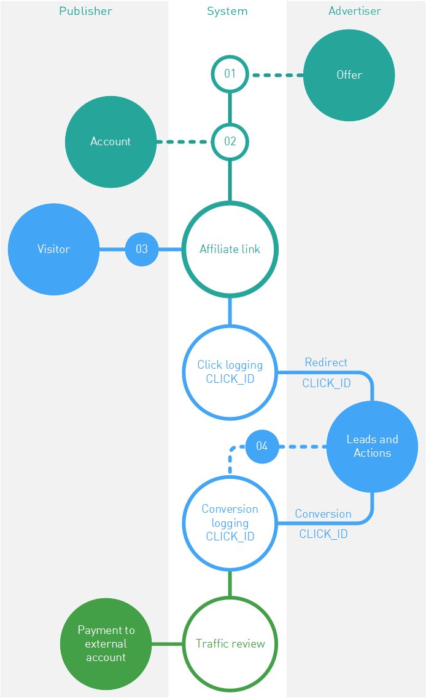
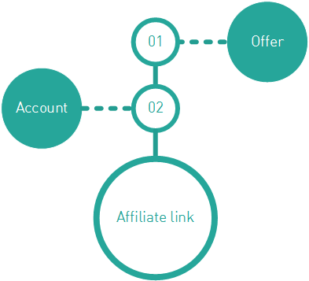

================
How it all works
================

Everybody is more or less aware of the partnership concept in the Internet marketing. But how the visitor actions are "traced" technically? Why clicks don't get lost? And how the advertiser will know where the visitors come from and whom the fees shall be paid to?

You can spend half of your life studying those complex and interesting aspects, but we'll try to explain in brief how our partner system works from the technical point of view.

.. rubric:: Preparation

First you need to fulfill the preconditions for generating affiliate links:

#. Firstly, the advertiser publishes its promotional offer in the affiliate network.
#. 2.	Any publisher can become an affiliate of such advertiser using the affiliate network, but for this purpose he or she needs to create an account in the network and get an affiliate link.

Then the publisher has to post a link on his/her resources and provide the relevant traffic.

.. rubric:: Working with the affiliate network 

After clicking the affiliate link a visitor will be forwarded to the advertiser's website, but there is also a bit of concealed web-magic, which is very important for all participants of the Internet marketing.

This magic is that before getting to the advertiser's website, the visitor's request first passes through the affiliate network and then, by using a redirect mechanism, is forwarded to the final destination.

The most important thing for the visitor to be traced in the affiliate network is the system identification of each click, the :code:`click_ID`. This parameter allows:

#. Click registration in the system. Counting clicks, analyzing stats and generation of forecasts.
#. Tracing the click life on the advertiser's side. The partner network submits this parameter to the advertiser, and later the advertiser will return it with a conversion.
#. Identify unambiguously the publisher receiving the fee and not to lose anything in the process.

After the system assigns a :code:`click_ID`,to the user click, such click will be forwarded to the advertiser for performing the actions beneficial to all the parties. Once the goals are reached, the advertiser's system will send a conversion notification to the affiliate network (don't forget, that it will be uniquely associated with a :code:`click_ID`). 

-------------------------------------------------------------------------------------------------------------------

.. _conversion-download-label:

.. rubric:: Выгрузки конверсий

.. tip::

   E.g. a customer made a purchase in an online store, clicked **Pay** button and the advertiser is now preparing the package for delivery… However the transferred funds got stuck between two banks, and the seller will receive money only in three days. Such delays are common, and they must be taken into account..

In many cases the advertiser technically is unable to notify of the conversion at the time of its execution. The reasons may be different, but in most cases the affiliate network and the advertiser agree on the term that will satisfy the interests of publishers and allow managing the advertiser's risks. When the date is due, the advertiser must submit the information on all orders and conversions to the affiliate network. We call such submission *an upload*.

If the affiliate network and the advertiser use the uploads, it is quite logical that the publishers conversions information appears with a delay exactly the same as the uploading period. Such details can be clarified in the tech support |support|_.

-----------------------------------------------------------------------------------------------------------------------

Once the conversion is registered in the affiliate network, the traffic inspection for cleanliness and integrity will be performed, and the affiliate network is responsible for it to the advertiser. Then, the scenarios are most favorable: due date occurs, and the payment for all conversions to :ref:`the external account <external-acc-label>` of the publishers occurs.

.. _partner-link:

===============
Affiliate links
===============

An affiliate link is the main reason for registration of the publisher in the affiliate network. Such link will allow redirecting the visitors to advertiser's website upon clicks on the adverts. 

The affiliate link is rigidly connected with two system objects and can not exist without them: a specific offer registered in the system and a specific publisher registered in the system. It also works "on the other side": based on the affiliate link the system can identify the link owner an the relevant offer.

Generally, the affiliate link looks as follow: :code:`https://<partner’s_domain>/<some_code>`

Here the :code:`<partner’s_domain>` parameter is not the advertiser's address, it's the address of the affiliate network. I.e. by clicking the link the visitor of your resource will be actually directed to the servers of the affiliate network. This is required to register this click on the affiliate network side → to control the conversion for this click → and then to pay the fee to the publisher.

*********************************
Where to find the affiliate links
*********************************

We are working on bringing you new content soon. Thanks for your patience.

.. _deep-link-label:

*********
Deep link
*********

Affiliate links lead to the advertiser's website. Well, yes. But where exactly do they lead? Websites have thousands of pages. More often than not, in an offer the advertiser does not bother to list all the URLs of its website, and just provides a point of entry — the main landing page. Usually it is the home page of the website.

The target link or the Deep link is the affiliate link to a page located deeper in the website. Usually deep links are generated in the interface of the affiliate network, but the choice of the destinations for links belongs to the publisher

****************************
How the generate a Deep link
****************************

We are working on bringing you new content soon. Thanks for your patience.

.. _subaccount-label:

==========
Subaccount
==========

We are working on bringing you new content soon. Thanks for your patience.

   

.. |01| image:: ../../img/start/02.png
   :scale: 65 %
   :align: right

