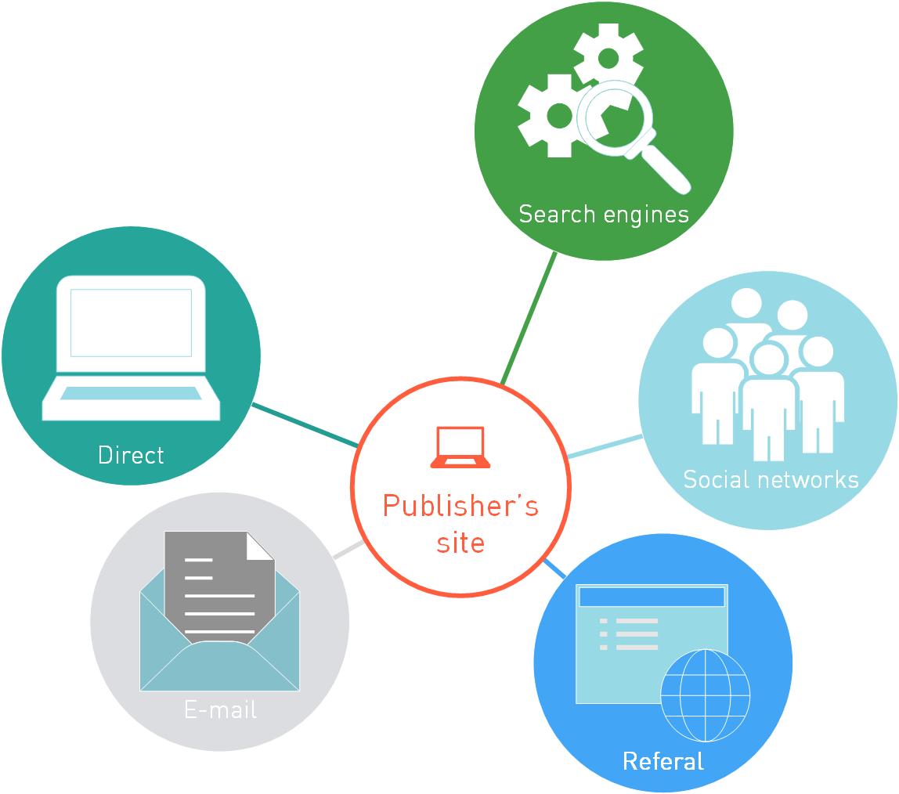

===========================
Affiliate marketing
===========================

So, you decided to earn on the Digital marketing, nice choice =) All you need is the traffic to redirect to ad links and people ready to pay for advertising.

Internet-marketing depends on the success of the advertising. Will the your visitor buy the product offered by your partners? Your partners are *advertisers* who got products to be advertised and sold. Advertiser's targets for advertisement campaigns may vary. *The target* is the key component in the affiliate program.

AFFILIATE PROGRAM
       It's the advertiser's project. It's the advertisement offer to the publishers.

By publishing the affiliate program the advertiser intends to say: "Dear publishers, here are my links, make your visitors click them. If your visitors buy something from me (or order something, or fill in the form) I'll pay for your efforts". And you start the cooperation. You fulfill the conditions of the advertiser, and the advertiser pays. It's simple, it's partner relations.

***********************************************
What's an affiliate network?
***********************************************

Now imagine that you don't need to be googling day and night to find partners. That they all gathered in one place, and published their offers all together. This dream is called an affiliate network.

AFFILIATE NETWORK
   It's an aggregator for affiliate programs. Many different offers from advertisers gathered in one place.

And those offers may vary greatly. It depends upon the scheme of the advertiser cooperation with the publisher. The most common scheme is CPA.

**************************
CPA and many other schemes
**************************

**CPA** means Cost Per Action. This abbreviation is used to identify the Internet marketing methodology based on payments that depend upon the actions of the visitor (not upon the impressions or clicks). ЭThis action will be agreed in advance in the terms of cooperation with a specific advertiser (see details in the :ref:`Offers<what-offer-can-be-label>`). For example let's take the game affiliate programs. Here the action will be the registration in the game, reaching a certain level, etc.

Basically, CPA covers all potential actions of the visitor, but for specialization one can define different models of the affiliate programs.

.. figure:: ../../img/start/cpa_cpi.png
       :scale: 100 %
       :align: center
       :alt: иерархическая структура сра

CPS (COST PER SALE)
   In this scheme the action is the sale. That is, if an advertiser sells something (rather than provides some services), this scheme might be quite OK. The advertiser decides how much it will pay for a sale (and the affiliate network tries to make this fee as high as possible). This can be a fixed amount ("fix" in the network slang) or a percentage of the sale amount. Here the compensation is one of the largest among the CPA offers because complete settlement with the visitor takes a long time, purchases are not frequent, and due to many other risks.

CPO (COST PER ORDER)
   Money is paid for submitting an order (in an online store) or for a confirmed order. In this scheme the visitor shall fill in and send a form. Online retailers, travel agencies, etc. may act as advertisers here.

CPI (COST PER INSTALL)
   The partner networks using this scheme pay for installations of software, mobile apps (games, catalogs, etc.) Most mobile offers use this scheme.

CPL (англ. Cost Per Lead)
   This model means payment for filling in the registration form (contacts of leads for further processing). Most often this scheme is used for online games and casino, as well as for various services (e.g. travel agencies).

.. _traffic-label:

*******
Traffic
*******

To understand the ways of earning money in the Internet you need to realize that it's all about the traffic. Traffic means everything. For arbitrage the main thing is to get the traffic at a low price and to sell it at a higher price. Success of any website is measured with the traffic. The main concern of the publisher is the quality of traffic and its volume.

Traffic vs visitor flow
========================

TRAFFIC
   Number of kilobytes passing through the website over a fixed period of time.

The traffic is generated by visitors. They surf the website, refresh web-pages and each web-page means a request and sending data to the server. By the way, the differentiation between the traffic and visitor flow is quite vague in the network. That's because the traffic is a direct function of visitor flow, and often traffic will mean the flow of visitors to your website. Generally, it's not a mistake. But it would be great if you understand the difference.

Types of traffic
================

So, traffic basically means the volume of data. While visitor flow means the number of visitors to your website. Traffic is like a flow to your website. But there must be a source for that flow. Here we come to the traffic sources, and these sources can be split into several groups:

#. **Direct traffic**. When the visitor types in the website name in the search field. Or saves the URL in favorites. In any case, the visitor comes to you directly, with no intermediaries.
#. **E-mail traffic**. Its source is in the mailings. After receiving an email the reader clicks some link and gets to your website.
#. **Traffic from external websites**. This group is the largest. For convenience the following major sub-sources are distinguished:

   #. **Search traffic** с сайтов-поисковиков, таких как Яндекс или Гугл.
   #. **Social traffic** originates from the social media.
   #. **Referral traffic**, it basically means the traffic originating from the external website. At that website another publisher published your link because he thinks your content is useful, or if you simply asked him or paid to him for such publication… As a result, the link is placed on the external website, and the traffic from this site is redirected to you, everyone is happy.

The above classification of traffic based on its source is called the **Traffic type**. Generally, knowing the traffic type we know the source of the traffic

.. _traffic-type-label:

Kinds of traffic
================

There's a battle for traffic in the Internet. To win that battle many different technologies were crafted to make a visitor of one website go to another website.

These technologies are numerous. Usually the following technologies are distinguished:

* SEO — Search Engine Optimization. Helps your website to stay in the TOPS of search engines.
* Contextual advertising
* Banner advertising
* Rich Media
* Price-Comparison (market places)
* Coupons/Promo codes
* Cashback
* Clickunder / Popunder
* Doorway or entry page
* Incentive

When you use a particular tool to redirect / generate the traffic this is called the **Traffic kinds**.

And that's what's behind it all. When you start monetizing your traffic through advertisement, the advertiser wants to know what you are going to use to redirect traffic to its web-pages. Because the traffic produced using different tools is very different (like holes dug with a shovel or a hammer). And advertisers often restrict certain tools for traffic generation or allows using only the approved tools.

