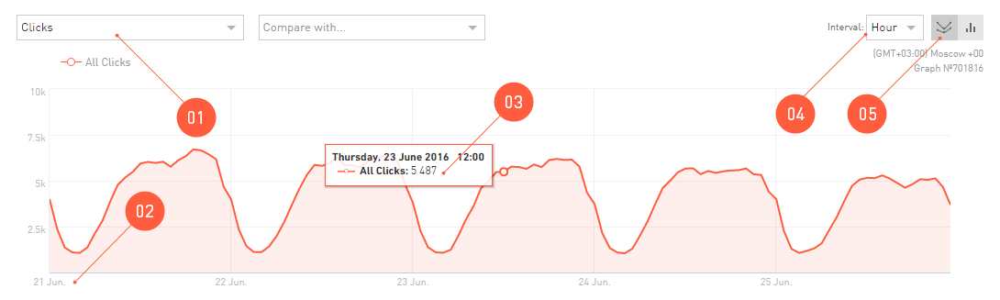

======================
Working with the Chart
======================

A chart is the same report from the table, but it is shown in the coordinate plane for you to analyze it more conveniently. With the default settings, the graph looks as follows:

 
There are additional functions in the **Chart** area for working and configuring the view:

#. An indicator for displaying on the graph. Depending on the report, you can select any indicator to display.
#. A chart is always drawn as a function of the number (e.g., of leads or clicks) vs. time. Only in the **Geography** report, the chart view differs from the usual one — you can see a map with the density of, e.g., clicks displayed.
#. A popup help with details containing particular numbers appears when you hover over any point on the graph with a mouse.
#. The time parameter can be changed to view the dynamics of the primary indicator not by days, but, e.g., by weeks. Please note that by selecting a very short period in the calendar – up to 10 days – you can view the statistics by hours, but the statistics by weeks will not be available for you.
#. The appearance of the graph can be switched to the bar charts.

*******************************************
Comparison of Two Indicators in the Chart
******************************************

Two functions of time can be displayed on the chart in the **Statistics**. I.e., the dynamics of two different indicators can be viewed throughout the selected :ref:`Period <statistics-calendar-label>`. 

.. figure:: ../../img/statistics/graph_two_param.png
       :scale: 100 %
       :align: center
       :alt: Comparison of Two Indicators in the  Chart
 
#. To compare the two charts by different indicators, click the **Compare with...**.
#. By clicking on the indicator name in the chart key, you can hide its drawing.
#. The scale of the *parameter to compare with* will differ from the first function on the graph, so we have displayed one more scale in the right
#. When you hover over any point on the graphs with a mouse, a detailed hint will pop up.

.. _additional_param_label:

***********************************
Additional indicators in the Chart
**********************************

We are working on bringing you new content soon. Thanks for your patience.

