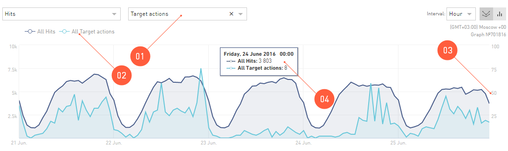

======================
Working with the Chart
======================

A chart is the same report from the table, but it is shown in the coordinate plane for you to analyze it more conveniently. With the default settings, the chart looks as follows:

.. figure:: ../../img/statistics/graph_overview.png
       :scale: 100 %
       :align: center
       :alt: overview of the statistics chart
 
There are additional functions in the **Chart** area for working and configuring the view:

#. An indicator for displaying on the chart. Depending on the report, you can select any indicator to display.
#. A chart is always drawn as a function of the number (e.g., of leads or clicks) vs. time. Only in the **Geography** report, the chart view differs from the usual one — you can see a map with the density of, e.g., clicks displayed.
#. A popup help with details containing particular numbers appears when you hover over any point on the chart with a mouse.
#. The time parameter can be changed to view the dynamics of the primary indicator not by days, but, e.g., by weeks. Please note that by selecting a very short period in the calendar – up to 10 days – you can view the statistics by hours, but the statistics by weeks will not be available for you.
#. The appearance of the chart can be switched to the bar charts.

*******************************************
Comparison of Two Indicators in the Chart
******************************************

Two functions of time can be displayed on the chart in the **Statistics**. I.e., the dynamics of two different indicators can be viewed throughout the selected :ref:`Period <statistics-calendar-label>`. 

 
#. To compare the two charts by different indicators, click the **Compare with...**.
#. By clicking on the indicator name in the chart key, you can hide its drawing.
#. The scale of the *parameter to compare with* will differ from the first function on the chart, so we have displayed one more scale in the right
#. When you hover over any point on the charts with a mouse, a detailed hint will pop up.

.. _additional_param_label:

***********************************
Additional indicators in the Chart
**********************************

The chart can be specified by adding a chart from the table of the report you are viewing at the moment.

.. tip:: For example, you are looking at the offer report, and the chart displays the leads. On the chart you can see the sum of all the leads from all the offer links. In **Statistics**, you can make the chart display leads of individual offers.

Let's assume you're viewing a report on the chart. The indicator displayed as the primary one is a *summary* indicator. This *summary* chart can be analyzed by its *summands*, i.e. its *components* can be displayed on the coordinate plane.

Display Components on the Chart
======================================

.. figure:: ../../img/statistics/graph_additional_param.png
       :scale: 100 %
       :align: center
       :alt: How to Display Components on the Chart
       
1. In the report table, choose up to four indicators that you wish to display in the chart.
2. Click :guilabel:`Add ti Chart`.
3. All the data displayed on the chart are listed in the chart key.
