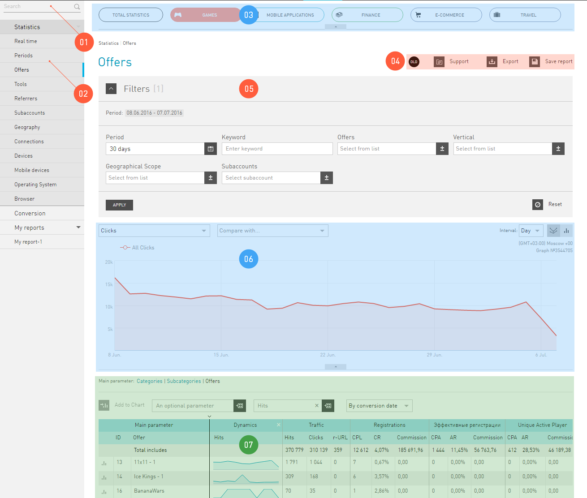

====================
Statistics interface
====================

As you know, those who own the information own everything. The most valuable information in Internet marketing is the latest figures about what is happening with the traffic. We provide you a powerful tool to analyze your traffic, and thus, your performance, — reports in the **Statistics** section. This information will help you to timely find issues and make proper decisions.

All reports in **Statistics** depend on the time in which you want to see the data. Please note that Statistics works only in two time zones:

* Moscow  (GMT+3)
* Sao Paulo (GMT-3)

.. seealso:: Where to set :ref:`the time zone <account-settings-label>`. 
 
This means that statistics is provided for these time zones. If you specified a time zone other than Moscow and Sao Paulo in your account, your statistics will work according to Moscow time by default.

.. rubric:: Giudance to statistics interface

 
For convenience, the **Statistics** interface is divided into «areas of responsibility»:

#.  Report **Search**. Helps to quickly find the report you need in the **Statistics** report tree. The reports you previously saved can also be found via this search.
#. **Reports navigation**. Contains a list of all report versions that **Statistics** provides.
#. :ref:`Skins <statistics-scin-label>`. panel. Skins are additional statistics filters by business areas. The **Games** skin provides statistics only for online games and the **Finance** skin — only for the finance vertical. But an important feature of the skins is that they adapt report tables to the selected business area.
#. First-aid area. Contains buttons to access documentation and additional functions: :ref:`Report Export <statistics-export-label>` и :ref:`Save report <statistics-save-label>`. By clicking the :guilabel:`OLD/NEW` button you can go to **Statistics** without skins.
#. :ref:`Filter <statistics-filter-label>` in which you can set the rules of compiling reports. It differs from other filters in our interface only by the way you save a customized set of filters — the :ref:`Save report <statistics-save-label>` button is located at the top, in the «first-aid».
#. :ref:`Chart <statistics-graph-label>`. This is a report shown in the form of an image. Here you can also find items you use to configure your chart..
#. And finally :ref:`Report <statistics-report-label>` itself. . All the information you requested is provided in the form of a table. Here you can find items you use to configure your report.

==================
Statistics Reports
==================

We are working on bringing you new content soon. Thanks for your patience.

Realtime Report
===============

We are working on bringing you new content soon. Thanks for your patience.
