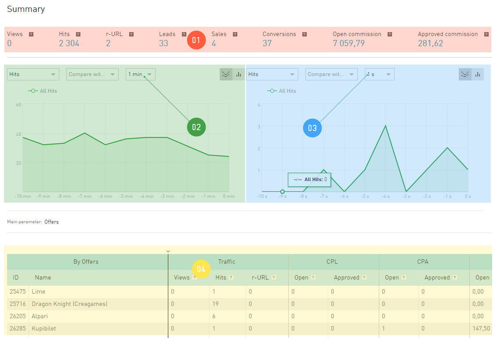

.. _statistics-label:

====================
Statistics Interface
====================

As you know, those who own the information own everything. The most valuable information in Internet marketing is the latest figures about what is happening with the traffic. We provide you a powerful tool to analyze your traffic, and thus, your performance, — reports in the **Statistics** section. This information will help you to timely find issues and make proper decisions.

All reports in **Statistics** depend on the time in which you want to see the data. Please note that **Statistics** works only in two time zones:

* Moscow  (GMT+3)
* Sao Paulo (GMT-3)

.. seealso:: Where to set :ref:`the time zone <account-settings-label>`. 
 
This means that statistics is provided for these time zones. If you specified a time zone other than Moscow and Sao Paulo in your account, your statistics will work according to Moscow time by default.

.. rubric:: Giudance to statistics interface

.. figure:: ../../img/statistics/overview.png
   :scale: 100 %
   :align: center
   :alt: How to navigate Statistics
 
For convenience, the **Statistics** interface is divided into «areas of responsibility»:

#.  Report **Search**. Helps to quickly find the report you need in the **Statistics** report tree. The reports you previously saved can also be found via this search.
#. **Reports navigation**. Contains a list of all report versions that **Statistics** provides.
#. :ref:`Skins <statistics-scin-label>`. panel. Skins are additional statistics filters by business areas. The **Games** skin provides statistics only for online games and the **Finance** skin — only for the finance vertical. But an important feature of the skins is that they adapt report tables to the selected business area.
#. First-aid area. Contains buttons to access documentation and additional functions: :ref:`Report Export <statistics-export-label>` и :ref:`Save report <statistics-save-label>`. By clicking the :guilabel:`OLD/NEW` button you can go to **Statistics** without skins.
#. :ref:`Filter <statistics-filter-label>` in which you can set the rules of compiling reports. It differs from other filters in our interface only by the way you save a customized set of filters — the :ref:`Save report <statistics-save-label>` button is located at the top, in the «first-aid».
#. :ref:`Chart <statistics-graph-label>`. This is a report shown in the form of an image. Here you can also find items you use to configure your chart..
#. And finally :ref:`Report <statistics-report-label>` itself. . All the information you requested is provided in the form of a table. Here you can find items you use to configure your report.

==================
Statistics Reports
==================

Statistics is a window through which you look at your traffic. It provides an opportunity to view it from different angles. Imagine that your traffic is a polyhedron, and by turning its different facets you study it from different points of view, and you can learn all about it. Each facet is a report that gives you an opportunity to study any property of your traffic in detail.

The main parameter
   Is the traffic property you inspect in the report.

Report names in the left menu in the **Statistics** group are the main parameter in accordance with which they are built. Within each report you can group data with different degree of refining (e.g. in a **Periods** report you can view data separately by **Years**, **Quarters**, **Months**, and etc.).

Real time Report
================

Such report shows statistics without delay. As soon as information about a hit/click/lead appears in our system, we will immediately publish it to users in this report.

The Real Time Report differs from others in that the data is received continuously, and the report page is updated on its own, with no additional action by the publisher. And there will be two charts on the page rather than one, because we provide new statistics on the publisher's traffic with one minute delay and the very latest statistics with a delay of just a second.

When you open **Real time** reports, you'll see an interface which is refreshed not synchronously, but by zones:

#.	**Summary** show data for the last hour. The countdown starts from the moment you go to the page of this report.
#.	**Statistics by minute** is refreshed according to the schedule you specify for it. The schedule is above the chart.
#.	**Statistics by second** is refreshed according to another schedule, you can also select it. The schedule is above the chart.

#.  **Report table** shows data for the last hour. The countdown starts from the moment you go to the page of this report. The traffic in this table is grouped by offers you work with.

Conversions Report
==================

You analyze your traffic using all reports in the **Statistics** tab. The **Conversion** report stands apart from other reports, since we display only the information on conversions in it, and nothing more. Using only Conversions Report, you cannot analyze your performance, unlike other reports showing performance indicators.

However, the **Conversion** report allows to analyze the conversion time lag in detail.
Conversion time lag is the time from clicking an affiliate link to the conversion (you can select **CPL** or **Target actions**).

The chart gives you the understanding of how many conversions occur during five (ten, fifteen, etc.) minutes after clicking the affiliate link.

The table shows the information about click → lead → action relation in the same line. 

* The click date is the time when a visitor clicks the affiliate link.
*	The order date is the date of the lead (primary target).
*	The Target action date is the time when the secondary target of the offer is achieved.
