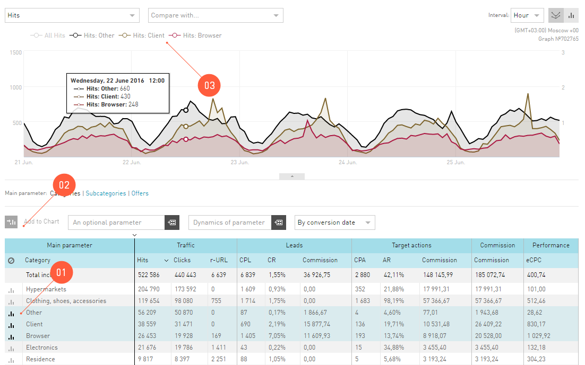
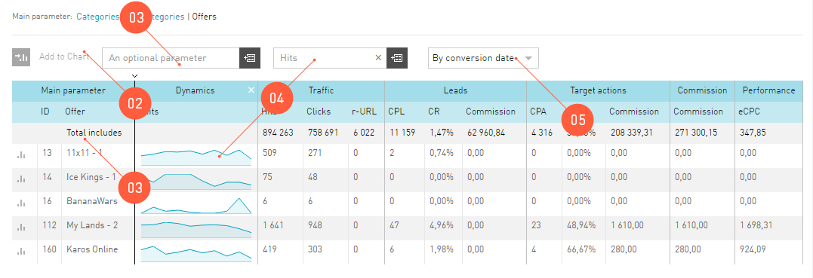

====================
Statistics interface
====================

We are working on bringing you new content soon. Thanks for your patience.

.. rudric:: Giudance to statistics interface

We are working on bringing you new content soon. Thanks for your patience.

******************
Statistics Reports
******************

We are working on bringing you new content soon. Thanks for your patience.

Realtime Report
===============

We are working on bringing you new content soon. Thanks for your patience.

Глобальный фильтр
=================

**Глобальный фильтр** задается в поле :guilabel:`Условия глобального фильтра`, над :guilabel:`Календарем`. Все условия, которые вы примените в **Глобальном фильтре**, будут распространятся на все отчеты **Статистики**. Ровно до тех пока вы лично не измените этот фильтр или не выключите его (кликните :guilabel:`Условия глобального фильтра|` кнопка :guilabel:`Сбросить`).

**Глобальный фильтр** отбирает в **Статистику** те данные, которые попадают под условия фильтра. Условия глобального фильтра бывают простые и сложные. Их вы настраиваете в панельке, которая появляется после клика на :guilabel:`Условия глобального фильтра`.

Как настроить Глобальный фильтр
-------------------------------
 
 .. figure:: ../../img/statistics/global_filter.png
       :scale: 100 %
       :align: center
       :alt: Календарь в статистике
 
1.	Кликните на значок **Глобального фильтра** (поле :guilabel:`Условия глобального фильтра`) в разделе **Статистика**.
2.	Выберите, какое условие хотите добавить: простое (**+**) или сложное (**++**).
3.	В каждом условии вы выбираете **Включить** или **Исключить** совпадение
4.	В поле :guilabel:`Критерии` выбираете из предложенных параметр, по которому хотите вводить условие.
5.	Выберите, по какому условию работает фильтр: полное совпадение (:guilabel:`Совпадает`), частичное совпадение в любой части слова (:guilabel:`Содержит`) или совпадение в начале слова (:guilabel:`Начинается с`).
6.	Введите условие поиска – слово или его часть.
7.	Если вы составляете сложное условие, выберите логическую функцию, по которой это условие работает.

Мои отчеты
==========

Наверняка у вас есть особенно любимые комбинации **Глобальных условий**, которые вы используете по многу раз. Например, вы часто анализируете траффик за прошедшую неделю по России. Чтобы вам дважды не настраивать :guilabel:`Календарь` и :guilabel:`Глобальный фильтр`, мы добавили возможность сохранения ваших любимых фильтров. 

Вы можете сохранить столько отчетов, сколько захотите. Все они будут отображаться в таблице :guilabel:`Статистика | Индивидуальные отчеты | Мои отчеты`. Чтобы просмотреть сохраненный отчет, просто кликните на название.

Сохранить фильтр
----------------

 .. figure:: ../../img/statistics/save_my_filter.png
       :scale: 100 %
       :align: center
       :alt: Сохранить фильтр в статистике
 
Чтобы один раз сохранить вашу любимую комбинацию :guilabel:`Календаря` и :guilabel:`Глобального фильтра`:

1. Перейдите в отчет, который используете чаще всего для анализа траффика.
2. Настройте глобальные условия: период в календаре и выборку по фильтру.
3. Нажмите на кнопку :guilabel:`Сохранить фильтр`, после чего дайте название фильтру, который сохраняете.
4. На вкладке :guilabel:`Статистика | Индивидуальные отчеты | Мои отчеты` появится тот отчет, который вы только что сохранили.

.. tip:: Когда вы настроите **Глобальные условия** и сохраните их, используя функцию :guilabel:`Сохранить фильтр`, то, кроме **Глобальных условий** сохранится и тот отчет, на котором вы сохраняли фильтр. Поэтому мы рекомендуем вам выбирать для каждого сохраняемого фильтра самый удобный отчет.

**********************
Автообновление отчетов
**********************

Когда вы работаете в **Статистике**, вы используете **Автообновление** по умолчанию. То есть, после выбора любого параметра, будь то условия **Глобальный фильтр** или **Типы дат**, отчет перестраивается сразу.

Но, если вам нужно перестроить отчет по двум параметрам, то приходится по очереди выбирать параметры и ждать, пока отчет перестроится по каждому из них.

Мы выделили группу параметров, которые можно настраивать одновременно, если выключить **Автообновление**. То есть, после того, как вы выберете все нужные вам настройки, можно сделать один запрос и сразу перестроить отчет по нескольким новым параметрам.

Параметры, которые можно настраивать одновременно
=================================================

 .. figure:: ../../img/statistics/autoupdate_full.png
       :scale: 100 %
       :align: center
       :alt: Автообновление в статистике
 
1.	Глобальный фильтр
2.	Календарь
3.	Типы дат
4.	Дополнительный параметр

Как это использовать?
=====================

1.	Первым делом, выключите **Автообновление**, переведя его в состояние **OFF**. |autoupdate_button_off|
2.	Настройте отчет по своему желанию используя **Глобальный фильтр, Календарь, Типы дат** или **Дополнительный параметр**.
3.	Примените настройки отчета, нажав на кнопку **Обновить**. |autoupdate_button_update|
  
.. hint:: Если выключить **Автообновление** вы будете меньше ждать конечный отчет.

*****************
Работа с Графиком
*****************

График — это тот же самый отчет из таблицы, только мы его вывели на координатную плоскость, чтобы вам было удобно его анализировать.
С настройками по умолчанию, график выглядит вот так:

.. figure:: ../../img/statistics/graph_overview.png
       :scale: 100 %
       :align: center
       :alt: графиу статистики общий вид
 
В зоне **Графика** есть дополнительные функции для работы и настройки внешнего вида:

1. Показатель для вывода на график. В зависимости от отчета вы можете выбрать любой показатель, чтобы он был отрисован на графике.
2. График всегда строится как функция количества (например, лидов или кликов) от времени.
3. Но параметр времени можно изменить, чтобы посмотреть динамику основного показателя не по дням, а, например, по неделям. Обратите внимание, что, выбрав в календаре очень короткий период – до 10 дней, вы сможете просмотреть статистику по часам, но зато статистика  по неделям вам будет недоступна.
4. Внешний вид графика можно изменить на столбчатые диаграммы.
5. Вплывающая подсказка, которая содержит подробности с конкретными цифрами, появляется при наведении курсора на точку на графике.
6. Вы можете скрить  график, если он вам надоел.

Сравнение двух разных показателей на графике
============================================

На график в **Статистике** можно вывести две функции от времени. То есть, просматривать динамику двух разных показателей в течение выбранного периода в Календаре. 

.. figure:: ../../img/statistics/graph_two_param.png
       :scale: 100 %
       :align: center
       :alt: график сравнение двух параметров
 
1.	Чтобы сравнить два графика по разным показателям, надо выбрать Показатель для сравнения.
2.	Его масштаб будет отличаться от первой функции на графике, поэтому мы вывели еще одну шкалу справа.
3.	Кликнув на название показателя в легенде графика, можно скрыть его отрисовку.
4.	Если навести курсор на точку на графиках всплывет подробная подсказка.

Дополнительные показатели на графике
====================================

На график можно добавить уточняющий график из таблицы отчета, который вы в данный момент просматриваете.

Предположим, вы в данный момент просматриваете отчет на графике. Тот показатель, который выводится на график в качестве основного, это *суммарный* показатель. Этот *суммарный* график можно проанализировать по *слагаемым*, то есть вывести на координатную плоскость *составные части*.

.. note:: Например, вы смотрите отчет по офферам, и на график выводятся **Лиды**. То, что вы видите на графике, это сумма всех лидов по ссылкам всех офферов. В **Статистике** на график вы можете вывести лиды по отдельным офферам.

Как вывести составные части на график
-------------------------------------

 
1.	Выберите в таблице отчета максимум три показателя, которые хотите вывести на график.
2.	Нажмите **На диаграмме**.
3.	Все данные, которые выводятся на график, перечислены в легенде графика.

**************
Таблица отчета
**************

Основная информация, которую предоставляет **Статистика**, выводится в таблице. Основной параметр в таблице – это тот параметр, который выведен в заголовок отчета. 

Таблица в **Статистике** настраивается так же, как и любая другая таблица в интерфейсе. Но у таблицы отчета в **Статистике** есть и дополнительные функции.

Функции таблицы отчетов
=======================

 
1. Параметр из отчета можно вывести на график. Подробности здесь.
2. Группировка по **Дополнительному параметру**. Выбрав любой из доступных **Дополнительных параметров**, вы получите отчет, который будет выводить в таблицу дополнительный параметр, как признак у основного параметра.
3. Упрощенная **Динамика показателя**. Динамика показателя – виджет, который можно добавить в таблицу отчета, выбрав показатель в выпадающем списке, расположенном над таблицей отчета. Динамика представляет собой график выбранного показателя за последние 10 дней (вне зависимости от выбранного периода).  

.. figure:: ../../img/statistics/table_dynamics.png
       :scale: 100 %
       :align: center
       :alt: таблица статистики, динамика показателя

4. Фильтр по ключевым словам. Введя ключевое слово и нажав Enter, вы получите отсортированный по вашим ключевым словам отчет.
5. Навигация по срезам отчетов. Внутри ряда отчетов существует возможность просматривать его по нескольким срезам (например, отчет по технологиям содержит возможность просматривать отчеты по браузерам, операционным системам, разрешениям экрана и другим параметрам устройств пользователей).

*****
Скины
*****

Что такое Скины?
================

В настоящее время в системе существует множество офферов и все они связаны с различными направлениями бизнеса. У каждого бизнес-направления своя специфика, разные цели, поэтому отчеты для каждого из них должны быть настроены по-разному. Скины упростят настройку параметров отчетов и разграничат данные по отдельным бизнес-направлениям.

Скин
      функционал **Статистики**, который позволяет выводить данные в зависимости от выбранного бизнес-направления.

Скины находятся вверху в **Статистике**. Но, если вы их не видите, то вам надо нажать на кнопку :guilabel:`OLD/NEW` в зоне «первой помощи», над :guilabel:`Сводными показателями`. Скройте скины, если они вам мешают.

Зачем нужны скины
-----------------

Скнины упрощают и делают более удобной работу в **Статистике**:

* Скины адаптируют графики **Статистики** и параметры в таблице отчетов для выбранного бизнес-направления. Подробнее в разделе Какие бывают скины.
* Скин предоставляет доступ к данным исключительно по выбранному бизнес-направлению.

Параметры отчетов в скинах
============================

В скинах есть показатели для целей, подходящие для каждого бизнес-направления.

По каждой цели предоставляются следующие статистические данные:

* **Количество достигнутых целей**. В отчетах представлены колонками CPL для первичных целей или CPA для вторичных.
* **Показатель конверсии**. В отчетах представлены колонками CR, Conversion Rate, для первичных целей или AR, Approval Rate, для вторичных.
* **Комиссия**. Если целевое действие оплачивается, то за каждое из них начисляется комиссия. В отчетах выводится суммарное количество комиссий по цели.

.. note::
    Показатель конверсии в общем виде это отношение количества целевых действий к общему количеству предшествующих действий и вычисляется в процентах. Соответственно для целей CPL или CPA:
   
    * для первичной цели CR = CPL/Клики,
    * для вторичной цели AR = CPA/CPL.

Какие бывают скины
==================

В настоящее время в системе есть скины по следующим бизнес-направлениям:

* Игры
* Мобильные офферы
* Подписки
* Финансы
* Электронная коммерция
* Путешествия

+-----------------------+-------------------------+---------------------+-------------------------------------------------------+
|          Скин         | Цели                    | Показатели          | Описание целевого действия                            |
+-----------------------+-------------------------+---------------------+-------------------------------------------------------+
|                       |                         |                     |                                                       |
+-----------------------+-------------------------+---------------------+-------------------------------------------------------+
|          Игры         | Регистрации             | CPL, CR, Комиссия   | Регистрации в игре.                                   |
+                       +-------------------------+---------------------+-------------------------------------------------------+
|                       | Эффективные регистрации | CPA, АR, Комиссия   | Эффективные Регистрации, например,                    |
|                       |                         |                     | вход в игру или достижение нескольких первых уровней. |
+                       +-------------------------+---------------------+-------------------------------------------------------+
|                       | Активные игроки         | CPА, АR, Комиссия   | Более глубокие действия, например,                    |
|                       |                         |                     | покупка в игре или пользователь достиг                |
|                       |                         |                     | высокого (10) уровня.                                 |
+-----------------------+-------------------------+---------------------+-------------------------------------------------------+
|    Мобильные офферы   | Установки               | CPI, CR, Комиссия   | Установки приложений пользователями.                  |
+                       +-------------------------+---------------------+-------------------------------------------------------+
|                       | Целевые действия        | CPА, АR, Комиссия   | В приложении совершены целевые действия,              |
|                       |                         |                     | например, достигнут уровень или приобретен контент.   |
+-----------------------+-------------------------+---------------------+-------------------------------------------------------+
|        Финансы        | Заявки                  | CPL, CR, Комиссия   | Оформленные заявки на продукт, ожидающие              |
|                       |                         |                     | статуса Подтверждения или Отмены.                     |
+                       +-------------------------+---------------------+-------------------------------------------------------+
|                       | Целевые действия        | CPА, АR, Комиссия   | Оформленные заявки, оплата которых одобрена.          |
+-----------------------+-------------------------+---------------------+-------------------------------------------------------+
| Электронная коммерция | Заказы                  | CPL, CR             | Оформленные заявки на товар/Оформленные заказы.       |
+                       +-------------------------+---------------------+-------------------------------------------------------+
|                       | Продажи                 | Открытые+Комиссия   | Открытые продажи, ожидающие                           |
|                       |                         |                     | статуса Подтверждения или Отмены.                     |
+                       +-------------------------+---------------------+-------------------------------------------------------+
|                       |                         | Отмененные+Комиссия | Продажи, оплата которых не одобрена.                  |
+                       +-------------------------+---------------------+-------------------------------------------------------+
|                       |                         | Одобренные+Комиссия | Продажи, оплата которых одобрена.                     |
+-----------------------+-------------------------+---------------------+-------------------------------------------------------+
|      Путешествия      | Заказы                  | CPL, CR             | Оформленные заявки на туры/Оформленные билеты.        |
+                       +-------------------------+---------------------+-------------------------------------------------------+
|                       | Продажи                 | Открытые+Комиссия   | Открытые продажи, ожидающие                           |
|                       |                         |                     | статуса Подтверждения или Отмены.                     |
+                       +-------------------------+---------------------+-------------------------------------------------------+
|                       |                         | Отмененные+Комиссия | Продажи, оплата которых не одобрена.                  |
+                       +-------------------------+---------------------+-------------------------------------------------------+
|                       |                         | Одобренные+Комиссия | Продажи, оплата которых одобрена.                     |
+-----------------------+-------------------------+---------------------+-------------------------------------------------------+

.. |autoupdate_button_off| image:: ../../img/statistics/autoupdate_button_off.png
.. |autoupdate_button_update| image:: ../../img/statistics/autoupdate_button_update.png

****************
Избранные отчеты
****************

Любой из отчетов в **Статистике** можно отметить звездочкой. Звездочку можно найти на панельке «первой помощи», над :guilabel:`Сводными показателями`. 
Эта звёздочка помечает отчет, как **Избранный**, и он будет отображаться на панели навигации в разделе guilabel:`Статистика | Избранные отчеты`. 
Эту функцию удобно использовать для быстрой навигации и перехода к часто востребованному отчету. 

***************
Экспорт отчетов
***************

Иногда, просмотр средствами нашего интерфейса недостаточно функционален для вебмастера. Это естественно, ведь в природе существует очень много приложений, специализирующихся на анализе числовых данных. Чтобы не ограничивать возможности наших вебмастеров, мы разработали функцию экспорта отчетов.

Если вам необходимо получить данные из статистики, чтобы анализировать траффик в других приложениях, сделайте следующее:

1. Перейдите в отчет, который вас интересует. Вы сможет выгрузить таблицу отчета, которую видите в интерфейсе.
2. В зоне «первой помощи», над Сводными показателями, нажмите кнопку Экспорт.
3. В диалоговом окне экспорта, выберите параметры для выгрузки отчета:
      1. Файл можно получить на почту (в приложении к письму) или скачать сразу из браузера.
      2. Доступные форматы данных для выгрузки это CSV, TSV, XLS. Их могут прочитать большинство табличных приложений.
4. После того, как вы нажмете кнопку Отправить:
      1. Браузер начнет скачивать файл в папку загрузок.
      2. Или на почту, которую вы указали, поступит письмо с приложением.
