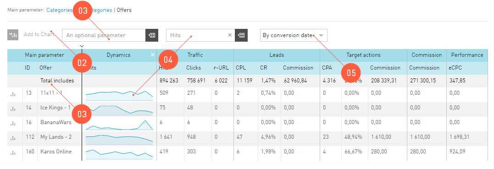

============
Report Table
============

The main information presented by **Statistics** is displayed in the table. The main parameter in the table is the one displayed in the report header. 

The table in the **Statistics** shall be configured like :ref:`any other table <table-label>` in the interface. However, the report table in the **Statistics** has additional functions::

#. There is a **Total includes** line in the report, which contains total amounts from the table.
#. A parameter from the report can be shown in the graph. See details :ref:`here <additional_param_label>`.
#. Any report can be adjusted by selecting the **Optional parameter**. If you select the **Optional parameter*, the data in the table will be regrouped according to the selected **Optional parameter**.
#. The **Dynamics** column can be added. **Dynamics** is a widget, which may be added to the report table by selecting an indicator from the dropdown list above the report table. The dynamics is a graph of the selected indicator for the last 10 days (irrespectively of the period selected).
#. How to regroup the data by various dates:

   #. Click: the date of the visitor's first click on the advertising link will be taken into account for all events.
   #.	Conversion: the date of conversion, i.e. target achievement, will be taken into account for all events.
   #.	Downloading: the date the event is registered in our affiliate network will be taken into account for all events.

.. _statistics-export-label:

=================
Export of Reports
=================

Viewing by means of our interface sometimes is not sufficiently functional for the publisher. It is natural, as there are a lot of applications specialized in analysis of numerical data. In order not to limit the capabilities of our publishers, we have developed the reports export function.

If you need to retrieve any data from the statistics to analyze the traffic in other applications, do the following:

#. Go to the report of interest. You can download the report table you see in the interface.
#. In the «first-aid» area above the :ref:`Filter <statistics-filter-label>`, click the :guilabel:`Export` button.
#. Select parameters in the export dialog window to download the report:

   #. The file may be received by email (attached to the message) or downloaded directly from the browser.
   #. The available data formats for downloading are CSV, TSV, XLS. They can be read by most table applications.

#. Once you click the :guilabel:`Send` button:

   #. The browser will start downloading the file to the Downloads folder.
   #. Or you will receive a message to the email you specified.

